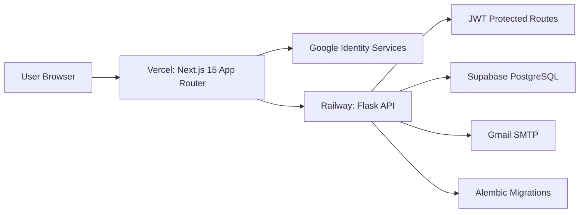

# TaskFlow SaaS

Production-ready task management SaaS built with Next.js 15, Flask, Supabase PostgreSQL, Google OAuth 2.0, Gmail SMTP, JWT auth, TanStack Query, DnD Kit, Framer Motion, and Recharts.

## Architecture



## Features

- Google OAuth sign-in through `/auth/google`
- JWT protected frontend routes and Flask API endpoints
- Task create, edit, delete, search, filter, sort
- User assignment with Gmail notification subject `New Task Assigned`
- Completion notification with Gmail subject `Task Completed`
- Analytics dashboard with status and priority charts
- Kanban board with instant drag-and-drop status persistence
- Responsive dark glassmorphism UI inspired by Linear, Notion, and Vercel

## File Tree

```text
.
├── backend
│   ├── app.py
│   ├── config.py
│   ├── Dockerfile
│   ├── extensions.py
│   ├── requirements.txt
│   ├── wsgi.py
│   ├── middleware/auth.py
│   ├── migrations
│   │   ├── alembic.ini
│   │   ├── env.py
│   │   ├── script.py.mako
│   │   └── versions/0001_initial_schema.py
│   ├── models
│   │   ├── __init__.py
│   │   ├── task.py
│   │   └── user.py
│   ├── routes
│   │   ├── auth.py
│   │   ├── dashboard.py
│   │   ├── tasks.py
│   │   └── users.py
│   ├── services
│   │   ├── email_service.py
│   │   └── google_auth.py
│   └── utils/validation.py
├── frontend
│   ├── app
│   │   ├── assigned/page.tsx
│   │   ├── dashboard/page.tsx
│   │   ├── globals.css
│   │   ├── layout.tsx
│   │   ├── login/page.tsx
│   │   ├── page.tsx
│   │   ├── profile/page.tsx
│   │   └── tasks
│   │       ├── board/page.tsx
│   │       └── page.tsx
│   ├── components
│   │   ├── app-shell.tsx
│   │   ├── providers.tsx
│   │   └── ui
│   │       ├── button.tsx
│   │       ├── card.tsx
│   │       ├── input.tsx
│   │       └── select.tsx
│   ├── features
│   │   ├── auth/login-card.tsx
│   │   ├── dashboard/dashboard-view.tsx
│   │   └── tasks
│   │       ├── kanban-board.tsx
│   │       ├── task-form.tsx
│   │       └── tasks-view.tsx
│   ├── hooks/use-auth.ts
│   ├── lib/utils.ts
│   ├── services/api.ts
│   ├── store/auth-store.ts
│   └── types/index.ts
└── docker-compose.yml
```

## Environment

Copy examples before running:

```bash
cp backend/.env.example backend/.env
cp frontend/.env.example frontend/.env
```

Backend variables:

- `DATABASE_URL`: Supabase PostgreSQL connection string
- `JWT_SECRET_KEY`: long random secret
- `GOOGLE_CLIENT_ID`: Google OAuth web client ID
- `FRONTEND_URL`: Vercel or local frontend URL
- `SMTP_USERNAME`, `SMTP_PASSWORD`, `SMTP_FROM`: Gmail account and app password

Frontend variables:

- `NEXT_PUBLIC_API_URL`: Railway backend URL or `http://localhost:5000`
- `NEXT_PUBLIC_GOOGLE_CLIENT_ID`: same Google OAuth web client ID

## Local Development

Backend:

```bash
cd backend
python -m venv .venv
.venv\Scripts\activate
pip install -r requirements.txt
flask --app app db upgrade
flask --app wsgi run --port 5000
```

Frontend:

```bash
cd frontend
npm install
npm run dev
```

Docker:

```bash
docker compose up --build
```

## API

- `POST /auth/google`
- `GET /users`
- `GET /tasks`
- `POST /tasks`
- `PUT /tasks/:id`
- `DELETE /tasks/:id`
- `PATCH /tasks/:id/status`
- `GET /dashboard/stats`

## Deployment

### Supabase

1. Create a Supabase project.
2. Copy the pooled or direct PostgreSQL connection URL.
3. Set it as `DATABASE_URL` on Railway.
4. Run `flask --app app db upgrade` from Railway shell or a one-off job.

### Render Backend

1. Create a Render web service from the `backend` directory.
2. Add every variable from `backend/.env.example`.
3. Set start command:

```bash
gunicorn wsgi:app --bind 0.0.0.0:$PORT --workers 3
```

4. Set `FRONTEND_URL` to the deployed Vercel URL.

### Vercel Frontend

1. Import the repo and set root directory to `frontend`.
2. Add every variable from `frontend/.env.example`.
3. Set NEXT_PUBLIC_API_URL to the Render backend URL.
4. Deploy.

## Feature Notes

- Authentication: Google ID token is verified server-side with `google-auth`, then the API issues a JWT.
- Tasks: SQLAlchemy models use UUID primary keys, enum status/priority, creator/assignee relationships, and Alembic migration `0001_initial_schema`.
- Email: `GmailService` centralizes SMTP and safely skips sending if credentials are missing in local development.
- Security: API requires JWT for users, tasks, and dashboard; request bodies are validated with Marshmallow; frontend forms are validated with Zod.
