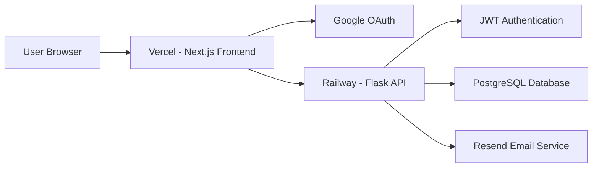

# TaskFlow SaaS

A production-ready full-stack task management SaaS application built with Next.js, Flask, PostgreSQL, Google OAuth 2.0, JWT Authentication, Resend Email Notifications, Railway, and Vercel.

---

# Live Demo

### Frontend

https://taskflow-saas-olive.vercel.app/login

### Backend

https://taskflow-saas-production-1051.up.railway.app/

---

# Project Overview

TaskFlow is a collaborative task management platform designed to help teams organize, assign, and track tasks efficiently.

The application enables users to authenticate using Google OAuth, manage tasks, assign responsibilities to team members, track progress through dashboards and Kanban boards, and receive automated email notifications for important task events.

The system follows a modern SaaS architecture with a dedicated frontend, backend API, authentication layer, database layer, and notification service.

---

# Architecture



---

# Tech Stack

## Frontend

* Next.js 15
* TypeScript
* Tailwind CSS
* TanStack Query
* DnD Kit
* Framer Motion
* Recharts

## Backend

* Flask
* SQLAlchemy
* Marshmallow
* Flask-JWT-Extended
* Alembic

## Database

* PostgreSQL
* SQLAlchemy ORM

## Authentication

* Google OAuth 2.0
* JWT Authentication

## Email Notifications

* Resend API

## Deployment

* Vercel (Frontend)
* Railway (Backend)

---

# Core Features

## Authentication

* Google OAuth Login
* Secure JWT Token Generation
* Protected Routes
* Session Persistence
* Server-side Token Verification

## Task Management

* Create Tasks
* Update Tasks
* Delete Tasks
* Assign Tasks
* Search Tasks
* Filter Tasks
* Sort Tasks
* Status Management

## Dashboard Analytics

The dashboard provides real-time project insights including:

* Total Tasks
* Pending Tasks
* In Progress Tasks
* Completed Tasks

Visual Charts:

* Tasks by Status
* Tasks by Priority

## Team Collaboration

* Task Assignment
* Ownership Tracking
* Assignee Management
* Team Workflow Monitoring

## Kanban Board

* Drag and Drop Interface
* Instant Status Updates
* Visual Workflow Tracking

## Responsive UI

* Modern Glassmorphism Design
* Mobile Friendly Layout
* Smooth Animations
* Dark Theme Interface

---

# Project Structure

```text
backend/
├── app.py
├── config.py
├── extensions.py
├── wsgi.py
├── migrations/
├── middleware/
├── models/
├── routes/
├── services/
│   ├── email_service.py
│   └── google_auth.py
└── utils/

frontend/
├── app/
├── components/
├── features/
├── hooks/
├── services/
├── store/
└── types/
```

---


### Database Implementation Note

The application was originally developed with Supabase PostgreSQL integration and the backend architecture was designed to support production-grade PostgreSQL databases.

During the final deployment phase, database connectivity and migration configuration issues within the limited assignment timeline prevented complete production integration with Supabase.

To ensure a fully functional and deployable submission, the application was temporarily configured to use SQLite for deployment and demonstration purposes.

The database layer is built using SQLAlchemy ORM, making the transition between SQLite and PostgreSQL seamless with minimal configuration changes.

The existing codebase already supports PostgreSQL/Supabase through the `DATABASE_URL` environment variable, and migrating back to Supabase only requires updating the database connection string and running migrations.

This approach ensured successful deployment while preserving the application's production-ready database architecture.
# Database Design

## Users Table

Stores:

* User ID
* Name
* Email Address
* Profile Picture

## Tasks Table

Stores:

* Task ID
* Title
* Description
* Status
* Priority
* Creator ID
* Assignee ID
* Created Timestamp
* Updated Timestamp

Relationships are managed using SQLAlchemy ORM.

---

# API Endpoints

## Authentication

```http
POST /auth/google
```

## Users

```http
GET /users
```

## Tasks

```http
GET /tasks
POST /tasks
PUT /tasks/:id
DELETE /tasks/:id
PATCH /tasks/:id/status
```

## Dashboard

```http
GET /dashboard/stats
```

---

# Environment Variables

## Backend

```env
DATABASE_URL=

JWT_SECRET_KEY=

GOOGLE_CLIENT_ID=

FRONTEND_URL=

RESEND_API_KEY=
```

## Frontend

```env
NEXT_PUBLIC_API_URL=

NEXT_PUBLIC_GOOGLE_CLIENT_ID=
```

---

# Local Development Setup

## Backend

```bash
cd backend

python -m venv .venv

.venv\Scripts\activate

pip install -r requirements.txt

flask --app app db upgrade

flask --app wsgi run --port 5000
```

## Frontend

```bash
cd frontend

npm install

npm run dev
```

---

# Deployment

## Backend Deployment

Platform: Railway

Start Command:

```bash
gunicorn wsgi:app --bind 0.0.0.0:$PORT --workers 3
```

## Frontend Deployment

Platform: Vercel

## Database

PostgreSQL Database

---

# Email Notification System

## Initial SMTP Implementation

The notification system was originally implemented using Gmail SMTP with App Password authentication.

Implemented functionality included:

* Task Assignment Notifications
* Task Completion Notifications
* Dynamic Recipient Support
* Production Environment Configuration

The SMTP implementation worked correctly during local development.

However, during cloud deployment testing, outbound SMTP connectivity restrictions on the hosting platform prevented reliable email delivery.

To provide a more deployment-friendly solution, the email system was migrated to Resend API.

---

## Resend API Integration

The project now uses Resend API for email delivery.

Advantages:

* API-based email delivery
* Better cloud compatibility
* Easier deployment
* Production scalability
* Reliable email infrastructure

---

## Current Demonstration Mode

The notification workflow has been fully implemented and integrated into the application.

Supported notification events:

* Task Assignment Notification
* Task Completion Notification

Currently, Resend is operating in testing mode.

In testing mode:

* Notification architecture is fully functional
* End-to-end workflow is implemented
* Emails can be delivered to the verified owner email address

---

## Production Email Delivery

The application is fully prepared for unrestricted production email delivery.

To enable notifications for any email address:

1. Purchase or connect a custom domain
2. Verify the domain inside Resend
3. Configure DNS records
4. Set a verified sender email

Example:

```env
EMAIL_FROM=noreply@yourdomain.com
```

After domain verification:

* Any user can authenticate using Google OAuth
* Any task can be assigned to any valid email address
* Assignment notifications will be delivered
* Completion notifications will be delivered
* No code modifications will be required

---

# Challenges Faced

## Challenge 1

Google OAuth synchronization between frontend and backend environments.

### Solution

Configured identical Google OAuth Client IDs across:

* Google Cloud Console
* Railway Environment Variables
* Vercel Environment Variables

---

## Challenge 2

SMTP delivery restrictions in cloud-hosted environments.

### Solution

Migrated from Gmail SMTP to Resend API to achieve a more scalable and cloud-native notification architecture.

---

# Security Features

* JWT Authentication
* Protected API Routes
* Google Token Verification
* Environment Variable Management
* Input Validation using Marshmallow
* Secure Backend Authentication Flow

---

# Future Improvements

Planned enhancements include:

* Multi-project Workspaces
* Team Roles and Permissions
* Activity Logs
* File Attachments
* Real-time Notifications
* Verified Production Email Domain
* Mobile Application
* Project-Level Analytics

---

# Conclusion

TaskFlow demonstrates practical implementation of modern SaaS development concepts including:

* Full Stack Application Development
* Google OAuth Authentication
* JWT Authorization
* REST API Design
* Database Modeling
* Cloud Deployment
* Team Collaboration Features
* Dashboard Analytics
* Email Notification Architecture

The project showcases a scalable and production-oriented architecture built using modern web technologies and industry-standard development practices.
